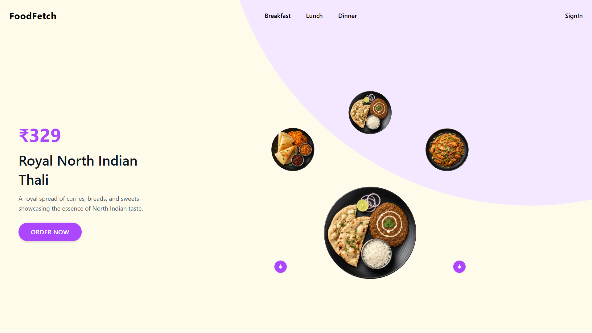
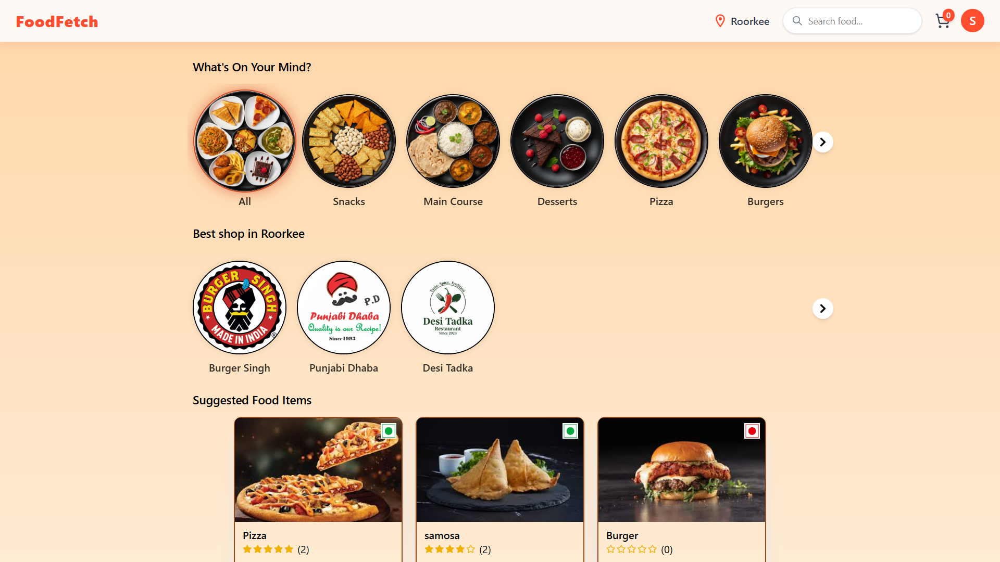
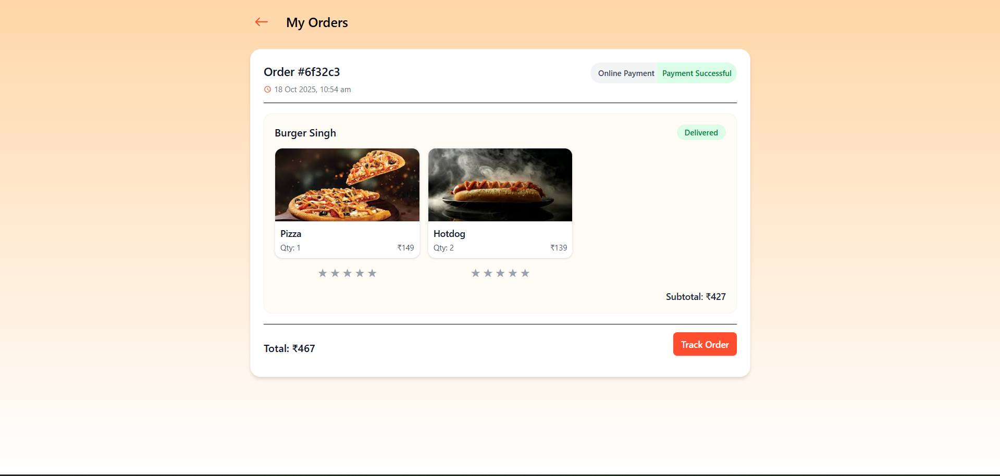

# 🍔 FoodFetch


FoodFetch is a full-stack food delivery web application that connects users, shop owners, and delivery partners.  
Users can browse food, place orders, pay securely, and track deliveries **in real time** — all in one place.

Built using **React, Node.js, Express, Socket.IO, Firebase Auth**, and **Razorpay**, FoodFetch delivers a modern and smooth online food ordering experience.

---

## 🚀 Demo

🎥 **Watch Demo Video:** [Click to Watch on YouTube](https://youtu.be/zN0nDZiAgnM)

[](https://youtu.be/zN0nDZiAgnM)

🌐 **Live Site:** [https://foodfetch.shailesh.cv](https://foodfetch.shailesh.cv)

---

## 🧩 Tech Stack

### ⚡ Frontend
- React (Vite)
- Redux Toolkit (for global state)
- Tailwind CSS
- Socket.IO Client (real-time updates)
- Firebase Authentication
- React Router DOM

### ⚙️ Backend
- Node.js + Express.js
- MongoDB + Mongoose
- Socket.IO (WebSockets)
- Razorpay API (Payment Integration)
- Firebase Admin SDK
- Cloudinary (Image storage)

---

## ✨ Key Features

- 🛍️ **Browse & Order Food** — Users can explore food by city and add to cart  
- 💳 **Secure Payment Integration** — Powered by Razorpay  
- 🚴 **Real-time Order Tracking** — WebSocket updates for delivery progress  
- 🧑‍🍳 **Shop Owner Dashboard** — Manage products, inventory, and orders  
- 📦 **Delivery Partner Dashboard** — View and update delivery status  
- 🔐 **User Authentication** — Login via Firebase  
- 🌍 **Live Location Handling** — Integrated geolocation and maps  
- 📱 **Responsive UI** — Built with Tailwind for all screen sizes  

---

## 🗂️ Project Structure

```
foodFetch/
│
├── frontend/         # React frontend (Vite)
│   ├── src/
│   ├── public/
│   └── package.json
│
├── backend/          # Express backend
│   ├── config/
│   ├── controllers/
│   ├── models/
│   ├── routes/
│   ├── utils/
│   └── package.json
│
└── README.md
```

---

## ⚙️ Installation & Setup

### 1. Clone the repository
```bash
git clone https://github.com/Shailo2002/foodFetch.git
cd foodFetch
```

### 2. Setup the backend
```bash
cd backend
npm install
npm run dev
```

### 3. Setup the frontend
Open a new terminal:
```bash
cd frontend
npm install
npm run dev
```

Frontend will start at [http://localhost:5173](http://localhost:5173)  
Backend will run at [http://localhost:8000](http://localhost:8000)

---

## 🔐 Environment Variables

### Backend `.env`
```
PORT=8000
FRONTEND_URL=http://localhost:5173

MONGODB_URL=your_mongodb_connection_string
JWT_SECRET=your_jwt_secret

EMAIL=your_email_address
EMAIL_PASS=your_email_password

CLOUDINARY_CLOUD_NAME=your_cloudinary_name
CLOUDINARY_API_KEY=your_cloudinary_api_key
CLOUDINARY_API_SECRET=your_cloudinary_api_secret

RAZORPAY_KEY_ID=your_razorpay_key_id
RAZORPAY_KEY_SECRET=your_razorpay_key_secret

```

### Frontend `.env`
```
VITE_SERVER_URL=http://localhost:8000

VITE_FIREBASE_APIKEY=your_firebase_api_key
VITE_GEOAPIKEY=your_geocoding_api_key
VITE_ORS_KEY=your_openrouteservice_key
VITE_RAZORPAY_KEY_ID=your_razorpay_key_id

```

---

## 🧠 Screenshots (Optional)
You can add screenshots like:

| Home Page | Order Tracking | Dashboard |
|------------|----------------|------------|
|  |  |  | 

---

## 🧑‍💻 Developer

**👤 Shailesh Parvadiya**  
💼 [GitHub](https://github.com/Shailo2002)  
🌐 [Portfolio](https://shailesh.cv)  
📧 shailesh364465@gmail.com 

---


⭐ **If you liked this project, please give it a star on GitHub — it helps a lot!**
